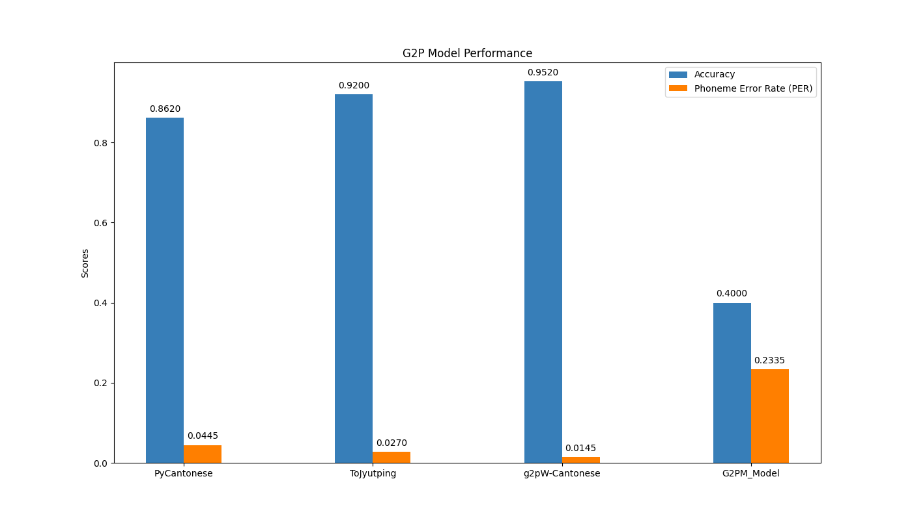
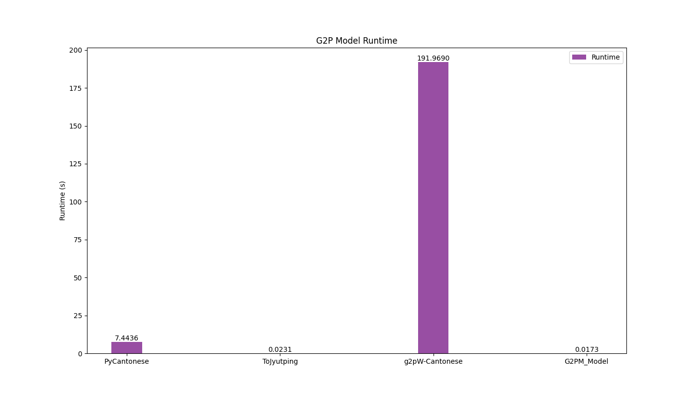

# Cantonese G2P Evaluation Benchmark

William Zhang

Princeton University Class of 2026

Advised by Christiane Fellbaum

Below is modified version of README.md found in: https://github.com/hon9kon9ize/yue-g2p-benchmark

This project is a benchmark for evaluating Cantonese Grapheme-to-Phoneme (G2P) systems. The benchmark is based on the [Jyutping Romanization System](https://en.wikipedia.org/wiki/Jyutping). The data is obtained from [word.hk](https://words.hk/), 100 samples from [Dufu-Analysis](https://github.com/wingmingchan64/Dufu-Analysis) and 500 colloquial Chinese transcribed from [CanCLID/zoengjyutgaai_saamgwokjinji](CanCLID/zoengjyutgaai_saamgwokjinji).

The dataset includes character pairs along with their corresponding ground truth phonemes for G2P model evaluation. Each text file line contains a word, an underscore (_), and the target character for phoneme prediction. This format focuses on single-character phoneme prediction within words, making it suitable for assessing G2P models on specific characters.

## Metrics

The benchmark evaluates Cantonese G2P systems using two primary metrics:

### Accuracy

- **Definition**: The percentage of instances where the specified character within a word is correctly converted from graphemes to phonemes.
- **Purpose**: This metric measures how often the G2P model accurately predicts the phoneme for the target character in the context of the word.

### Phoneme Error Rate (PER)

- **Definition**: The proportion of phoneme components that are incorrectly predicted.
- **Calculation Details**:
  - **Syllable Decomposition**: Each Jyutping syllable is broken down into four components: **onset**, **nucleus**, **coda**, and **tone**.
  - **Hamming Distance**: PER is calculated by computing the Hamming distance between the predicted and ground truth quadruples (onset, nucleus, coda, tone).
    - For example, if the ground truth is `(s, a, i, 2)` and the prediction is `(s, a, m, 2)`, the Hamming distance is 1 (since only the coda differs).
  - **Multiple Labels Handling**: If multiple valid pronunciations (alternative labels) exist for a character, the PER is computed using the label that minimizes the Hamming distance to the prediction.
- **Purpose**: PER provides a fine-grained evaluation by identifying specific phoneme components where errors occur, offering insights into the model's phonological performance.

### Precision, Recall, and F1 Score

- **Definition**: These metrics evaluate the model's performance in terms of precision, recall, and F1 score for phoneme prediction.
  - **Precision**: The proportion of correctly predicted phonemes out of all predicted phonemes.
  - **Recall**: The proportion of correctly predicted phonemes out of all ground truth phonemes.
  - **F1 Score**: The harmonic mean of precision and recall.
- **Purpose**: These metrics provide a comprehensive evaluation of the model's ability to correctly predict phonemes and handle imbalanced data.

### Part-of-Speech (POS) Accuracy

- **Definition**: The accuracy of phoneme predictions for each part-of-speech tag.
- **Purpose**: This metric evaluates the model's performance in predicting phonemes for different parts of speech, providing insights into its linguistic capabilities.

### Rationale for Metric Choices

#### Exclusion of Levenshtein Distance

Previously, the Levenshtein distance was considered for evaluating G2P performance but was found to be unsuitable for this benchmark due to:

1. **Dependency on Romanization System**:
   - The Levenshtein distance operates on the Jyutping romanization strings, which can bias the results based on spelling conventions rather than actual phonetic differences.
   - Different romanization systems might represent the same sounds with different letters or letter combinations, affecting the distance calculation.

2. **Positional Pronunciation Variations**:
   - In Cantonese, certain letters represent sounds that change depending on their position within a syllable.
     - **Example**: The letters **p**, **t**, and **k** are aspirated when they appear at the beginning (**onset**) of a syllable but are unreleased when they appear at the end (**coda**).
   - Levenshtein distance does not account for these positional differences, potentially overestimating errors when letters are the same but their pronunciations differ due to their positions.

By using **Accuracy**, **Phoneme Error Rate (PER)**, **Precision**, **Recall**, **F1 Score**, and **POS Accuracy** based on phonetic components, the benchmark provides a more accurate and meaningful evaluation of G2P systems that reflects true phonological performance rather than orthographic or romanization discrepancies.


## Training G2PM

The G2PM model is trained using the following steps:

1. **Data Preparation**:
   - **Character and Pronunciation Mapping**: Create mappings from characters to indices (`char2idx`) and from pronunciations to indices (`class2idx`). This involves processing monophonic and polyphonic characters and saving the mappings to pickle files.
   - **Dataset Loading**: Load the dataset and convert characters and labels to indices. Pad sequences to ensure uniform input lengths.

2. **Model Initialization**:
   - **Embedding and LSTM Initialization**: Define the model architecture, including embedding layers, LSTM layers, and fully connected layers. Initialize model weights using Xavier uniform initialization.
   - **State Dictionary**: Save the initialized model weights to a state dictionary.

3. **Training**:
   - **Batch Generation**: Generate batches of data for training.
   - **Loss Computation**: Compute the loss using negative log likelihood. This involves recomputing hidden states, applying softmax to get probabilities, and calculating the negative log likelihood of the correct classes.
   - **Weight Update**: Use the Adam optimizer to update model weights. This involves computing gradients and updating weights based on the gradients.
   - **Training Loop**: Train the model for a specified number of epochs, evaluating on a validation set after each epoch.

4. **Evaluation**:
   - **Validation**: Evaluate the model on a validation set using the defined metrics.
   - **Model Saving**: Save the trained model for future use.

### Example Code for Training G2PM

The following code snippets illustrate the steps involved in training the G2PM model:

#### Data Preparation

1. **Create Character and Pronunciation Mappings**:
   - Process monophonic and polyphonic characters to create `char2idx` and `class2idx` mappings.
   - Save the mappings to pickle files.

2. **Load and Prepare Data**:
   - Load the dataset and convert characters and labels to indices.
   - Pad sequences to ensure uniform input lengths.

#### Model Initialization

1. **Initialize Model Weights**:
   - Define the model architecture, including embedding layers, LSTM layers, and fully connected layers.
   - Initialize model weights using Xavier uniform initialization.
   - Save the initialized model weights to a state dictionary.

#### Training

1. **Generate Batches**:
   - Generate batches of data for training.

2. **Compute Loss**:
   - Compute the loss using negative log likelihood. This involves recomputing hidden states, applying softmax to get probabilities, and calculating the negative log likelihood of the correct classes.

3. **Update Weights**:
   - Use the Adam optimizer to update model weights. This involves computing gradients and updating weights based on the gradients.

4. **Training Loop**:
   - Train the model for a specified number of epochs, evaluating on a validation set after each epoch.

#### Evaluation

1. **Validation**:
   - Evaluate the model on a validation set using the defined metrics.

2. **Save Model**:
   - Save the trained model for future use.


## Usage

### Pre-requisites

```bash
# pull submodules
git submodule update --init --recursive
# install dependencies
pip install -r requirements.txt
# install g2pW-Cantonese dependencies
pip install -r g2pW-Cantonese/requirements.txt
```

### Run the Benchmark

```bash
python run.py
```

## Leaderboard



## Runtime Comparison



## How to Submit

To submit your G2P system, please subclass the `G2PModel` class in `models` and implement the `_predict` method. Then, add your model to the `models` list in `run.py`. Finally, run `run.py` to generate the results.

# Acknowledgements

This project is a Fall 2024 independent work. Special thanks to Professor Christiane Fellbaum, Joseph Cheng, Naozumi520, and my classmates in IW seminar for their weekly feedback on my work.

Thank you to h0nk0ngize community, Kako Brain, E.Sun Financial Holding and the Department of Mathematics at National Kaohsiung Normal University . Without their work, this project would not have been possible.

This repository was adapted from [yue-g2p-benchmark](https://github.com/hon9kon9ize/yue-g2p-benchmark). Proper credit is given to the original authors.